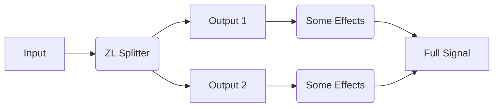
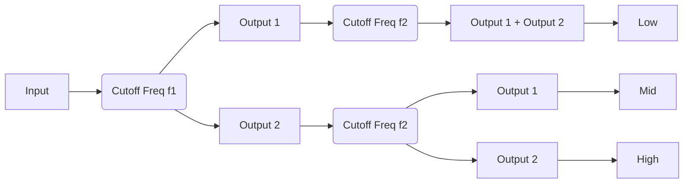

___

## Introduction Video



## About

ZL Splitter is a multifunctional audio splitter plugin, which can split the input signal into:

- left/right signal
- mid/side signal
- low/high signal
- transient/steady signal

The routing may look like follows:

## Installation

Visit [this link](https://github.com/ZL-Audio/ZLSplitter/releases/latest) and download the installer that matches your OS:

- If the file has a `.dmg` extension, it is for macOS (in `VST3` & `AU`).
- If the file has a `.exe` extension, it is for Windows (in `VST3` & `LV2`).
- If the file has a `.zip` extension, it is for Linux (in `VST3` & `LV2`).

For more information, please refer to the [Plugin Installation](../help/plugin_installation) page.

ZL Splitter is licensed under [GPLv3](https://www.gnu.org/licenses/gpl-3.0.en.html).

GPLv3 Section 9 *Acceptance Not Required for Having Copies*:

**You are not required to accept this License in order to receive or run a copy of the Program. Ancillary propagation of a covered work occurring solely as a consequence of using peer-to-peer transmission to receive a copy likewise does not require acceptance. However, nothing other than this License grants you permission to propagate or modify any covered work. These actions infringe copyright if you do not accept this License. Therefore, by modifying or propagating a covered work, you indicate your acceptance of this License to do so.**

VST® is a trademark of Steinberg Media Technologies GmbH, registered in Europe and other countries.

## User Interface

The user interface consists of a top panel, a left panel, and a right panel.

### Common Components

#### Button

Click the button to switch between the "pressed" and "released" states.

#### Rotary/Horizontal/Vertical Slider

Values can be adjusted by dragging/clicking with the mouse or scrolling the mouse wheel. You can enable mouse wheel fine adjustment with Ctrl/Command.

### Top Panel

___

  
  

Double-clicking the icon to open the [UI setting panel](#ui-setting-panel).

___

  

- Press: `Output 1` outputs right/side/high/steady signal; `Output 2` outputs left/mid/low/transient signal.
- Release: `Output 1` outputs left/mid/low/transient signal; `Output 2` outputs right/side/high/steady signal.

___

**Split Type**

  

Left/Right Split

  

Mid/Side Split

  

Low/High Split

  

Transient/Steady Split

___

### Left Panel

The bottom panel controls the parameters of the currently selected split type, which will change according to the current split type.

#### Left/Right Split

___

**Mix**

The mix portion of left/right signal.

___

#### Mid/Side Split

___

**Mix**

The mix portion of mid/side signal.

___

#### Low/High Split

___

**Mix**

The mix portion of low/high signal.

___

**Filter Structure**

- SVF：state variable structure
- FIR：truncated reversed structure

> When the filter structure is SVF, the filter will change the phase significantly. Under such situation, you should not mix the output with the original signal directly or cascade multiple low/high splitters. If you do need to cascade SVF filters, you may refer to [Cascade SVF Filters](#cascade-svf-filters).

> When the filter structure is FIR, the filter will NOT change the phase. However, it will cause latency, the amount of which depends on the sample rate and the filter slope.

___

**Filter Slope**

There are three slopes: 12 dB/oct, 24 dB/oct and 48 dB/oct.

___

**Cutoff Frequency (Freq)**

___

#### Transient/Steady Split

___

**Strength**

When it is 0, no separation occurs.

___

**Balance**

The smaller the balance, the less transient signal and the more steady signal, and vice versa.

___

**Hold**

The larger the hold, the slower the decay of transient signal.

___

**Spectrum Smoothness (Smooth)**

- When it is 0, the different frequencies of the signal are split into transient and steady signals relatively independently.
- When it is 100, the signal is split into transient and steady signals as a whole.

___

### UI Setting Panel

The UI setting panel controls colours, slider operations, etc. Components will be introduced in the order from top to bottom.
___

You can adjust the colour by clicking on the left colour block.

**Text Colour**

**Background Colour**

For better accessibility, please set Text/Background to colours with high contrast.

**Shadow Colour**

**Glow Colour**

**Mouse-Wheel Sensitivity**

- Rough: mouse-wheel sensitivity when Ctrl/Command is not pressed
- Fine: mouse-wheel sensitivity when Ctrl/Command is pressed

**Rotary Slider Style**

- Circular: A rotary control that you move by dragging the mouse in a circular motion, like a knob
- Horizontal: A rotary control that you move by dragging the mouse left-to-right
- Vertical: A rotary control that you move by dragging the mouse up-and-down
- Horiz + Vert: A rotary control that you move by dragging the mouse up-and-down or left-to-right
- Distance: the relative distance that the mouse has to move to drag the slider across the full extent of its range. It does not apply to the Circular style.

___

  

Save the current setting.

___

  

Discard all unsaved settings and load the previously saved settings.

___

  

Discard all unsaved settings and close the UI setting panel.

___

## Appendix

### Automation

You can automate all parameters. During automation, Mix and Cutoff Frequency of SVF filters change per sample while the other parameters change per buffer.

### Cascade SVF Filters

## Acknowledgment

Thank [JUCE](https://github.com/juce-framework/JUCE) framework and [JUCE Forum](https://forum.juce.com/).

Thank all plugin users for their support, feedback, and suggestions.

## Feedback

If you have general suggestions or questions, you can open a discussion [here](https://github.com/ZL-Audio/ZLSplitter/discussions).

If you have specific bug reports or feature requests, you can open an issue [here](https://github.com/ZL-Audio/ZLSplitter/issues).

## Disclaimer

This disclaimer comes from section 15 and section 16 of [GPLv3 License](https://www.gnu.org/licenses/gpl-3.0.en.html).

**THERE IS NO WARRANTY FOR THE PROGRAM, TO THE EXTENT PERMITTED BY APPLICABLE LAW. EXCEPT WHEN OTHERWISE STATED IN WRITING THE COPYRIGHT HOLDERS AND/OR OTHER PARTIES PROVIDE THE PROGRAM “AS IS” WITHOUT WARRANTY OF ANY KIND, EITHER EXPRESSED OR IMPLIED, INCLUDING, BUT NOT LIMITED TO, THE IMPLIED WARRANTIES OF MERCHANTABILITY AND FITNESS FOR A PARTICULAR PURPOSE. THE ENTIRE RISK AS TO THE QUALITY AND PERFORMANCE OF THE PROGRAM IS WITH YOU. SHOULD THE PROGRAM PROVE DEFECTIVE, YOU ASSUME THE COST OF ALL NECESSARY SERVICING, REPAIR OR CORRECTION.**

**IN NO EVENT UNLESS REQUIRED BY APPLICABLE LAW OR AGREED TO IN WRITING WILL ANY COPYRIGHT HOLDER, OR ANY OTHER PARTY WHO MODIFIES AND/OR CONVEYS THE PROGRAM AS PERMITTED ABOVE, BE LIABLE TO YOU FOR DAMAGES, INCLUDING ANY GENERAL, SPECIAL, INCIDENTAL OR CONSEQUENTIAL DAMAGES ARISING OUT OF THE USE OR INABILITY TO USE THE PROGRAM (INCLUDING BUT NOT LIMITED TO LOSS OF DATA OR DATA BEING RENDERED INACCURATE OR LOSSES SUSTAINED BY YOU OR THIRD PARTIES OR A FAILURE OF THE PROGRAM TO OPERATE WITH ANY OTHER PROGRAMS), EVEN IF SUCH HOLDER OR OTHER PARTY HAS BEEN ADVISED OF THE POSSIBILITY OF SUCH DAMAGES.**