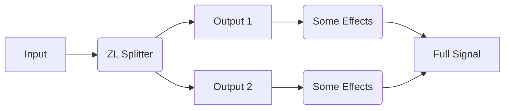
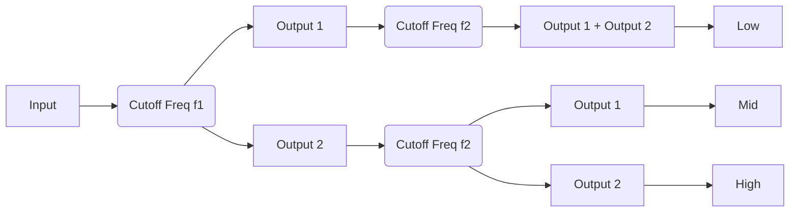

___

## About

ZL Splitter is a multifunctional audio splitter plugin, which can split the input signal into:

- left/right signal
- mid/side signal
- low/high signal
- transient/steady signal
- peak/steady signal

The routing may look like the following:

## Top Panel

___

  
  

You can open the [UI setting panel](#ui-setting-panel) by double-clicking the logo.

___

**Analyzer Legend**

___

**FFT**

- Press: turn on the FFT analyzer

___

**MAG**

- Press: turn on the magnitude analyzer

___

  

- Press: swap Output 1 and Output 2

___

  

- Release: bypass the plugin

___

## Left Panel

When the mouse is moved to the left side of the plugin window, the left panel will show up, from which you can choose and adjust the splitting mode. You can close it by clicking on the [Analyzer Panel](#analyzer-panel).

___

  

- Press: Input -> Output 1, Silence -> Output 2

  

- Press: Left -> Output 1, Right -> Output 2

  

- Press: Mid -> Output 1, Side -> Output 2

  

- Press: Low -> Output 1, High -> Output 2

  

- Press: Transient -> Output 1, Steady -> Output 2

  

- Press: Peak -> Output 1, Steady -> Output 2

___

### Left/Right Split

___

**Mix**

The mix portion of left/right signal.

___

### Mid/Side Split

___

**Mix**

The mix portion of mid/side signal.

___

### Low/High Split

___

**Mix**

The mix portion of low/high signal.

___

**Filter Structure**

- SVF：state variable structure
- FIR：truncated reversed structure

> When the filter structure is SVF, the filter will change the phase significantly. Under such situation, you should not mix the output with the original signal directly or cascade multiple low/high splitters. If you do need to cascade SVF filters, you may refer to [Cascade SVF Filters](#cascade-svf-filters).

> When the filter structure is FIR, the filter will NOT change the phase. However, it will cause latency, the amount of which depends on the sample rate and the filter slope.

___

**Filter Slope**

There are three slopes: 12 dB/oct, 24 dB/oct and 48 dB/oct.

___

**Cutoff Frequency (Freq)**

___

### Transient/Steady Split

Unlike Peak/Steady Split, Transient/Steady Split uses a FFT based model to split transient/steady signal. They do not share parameters.

___

**Strength**

When it is 0, no separation occurs.

___

**Balance**

The smaller the balance, the less transient signal and the more steady signal, and vice versa.

___

**Hold**

The larger the hold, the slower the decay of transient signal.

___

**Spectrum Smoothness (Smooth)**

- When it is 0, the different frequencies of the signal are split into transient and steady signals relatively independently.
- When it is 100, the signal is split into transient and steady signals as a whole.

___

### Peak/Steady Split

Unlike Transient/Steady Split, Peak/Steady Split uses a compressor-like model to split peak/steady signal. They do not share parameters.

____

**Attack**

The larger the attack, the slower the start of the peak signal.

____

**Balance**

The smaller the balance, the less the peak signal and the more the steady signal, and vice versa.

___

**Hold**

The larger the hold, the slower the decay of the peak signal.

___

**Smooth**

The larger the smooth, the less the frequency of the change of peak/steady.

___

## Analyzer Panel

### FFT Analyzer

- You can choose the lowest frequency at the bottom-left corner
- You can choose the highest frequency at the bottom-right corner
- You can choose the minimum dB scale at the bottom-right corner
- You can freeze the FFT analyzer by holding the mouse over it for 2 seconds, and unfreeze it by moving the mouse

### Magnitude Analyzer

- You can choose the time length at the bottom-left corner
- You can choose the magnitude type at the bottom-right corner
- You can choose the minimum dB scale at the bottom-right corner

___

## UI Setting Panel

The UI setting panel controls analyzer colours, slider operations, etc. Components will be introduced in the order from top to bottom.

#### Colour

You can adjust the colour by clicking on the left colour block and change the transparency by dragging the right slider.

**Text Colour**

**Background Colour**

For better accessibility, please set Text/Background to colours with high contrast.

**Shadow Colour**

**Glow Colour**

**Grid Colour**

**Output1 Colour**

**Output2 Colour**

**Colour Map 1

**Colour Map 2**

**Import Colours**

- import colour settings (`.xml` file)

**Export Colours**

- export colour settings (`.xml` file)

#### Control

**Wheel Sensitivity**

- Rough: mouse-wheel sensitivity when Shift is not pressed
- Fine: mouse-wheel sensitivity when Shift is pressed
- Reverse: whether to reverse the direction of mouse-wheel when Shift is pressed

**Drag Sensitivity**

- Rough: mouse-drag sensitivity when Shift is not pressed
- Fine: mouse-drag sensitivity when Shift is pressed

**Rotary Slider Style**

- `Circular`: A rotary control that you move by dragging the mouse in a circular motion, like a knob
- `Horizontal`: A rotary control that you move by dragging the mouse left-to-right
- `Vertical`: A rotary control that you move by dragging the mouse up-and-down
- `Horiz + Vert`: A rotary control that you move by dragging the mouse up-and-down or left-to-right
- Distance: the relative distance that the mouse has to move to drag the slider across the full extent of its range. It does not apply to the Circular style.

**Slider Double Click**

- `Return Default`: when you double-click the slider, it returns to the default value; when you double-click the slider with Ctrl/Command, it opens the value editor.
- `Open Editor`: when you double-click the slider, it opens the value editor; when you double-click the slider with Ctrl/Command, it returns to the default value.

**Import Controls**

- import control settings (`.xml` file)

**Export Controls**

- export control settings (`.xml` file)

#### Other

**Refresh Rate**

For better analyzer display, set this as 1/n of your monitor refresh rate. For example,
- If your monitor refresh rate is 120 Hz, set it to 120 Hz, 60 Hz (1/2), or 30 (1/4) Hz. DO NOT set it to 90 Hz.
- If your monitor refresh rate is 90 Hz, set it to 90 Hz or 30 Hz (1/3). DO NOT set it to 60 Hz.

**FFT  Setting**

- Tilt: the extra tilting slope of the FFT
- Speed: the extra decay speed of the FFT

**Curve Thickness**

Controls the thickness of the magnitude analyzer and the FFT analyzer.

**Tooltip**

Choose the tooltip language. It will take effect when the plugin window is re-opened.
#### Bottom Buttons

___

  

- Save the current setting.

___

  

- Load the default settings of some colours.

___

  

- Discard all unsaved settings and close the UI setting panel.

___

## Shortcuts

Generally, you can enable fine-adjustment with Shift and enable special adjustment with Ctrl/Command. If the direction of the mouse wheel is reversed when Shift is pressed, you can reverse it again to put it back to normal.

- when using the mouse to drag / the mouse wheel to adjust sliders, you can enable fine-adjustment with Shift

## Appendix

### Automation

You can automate all parameters. During automation, Mix and Cutoff Frequency of SVF filters change per sample while the other parameters change per buffer.

### Cascade SVF Filters

