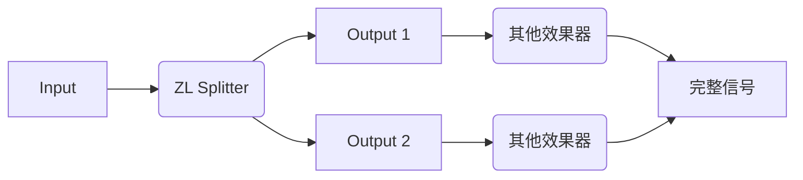
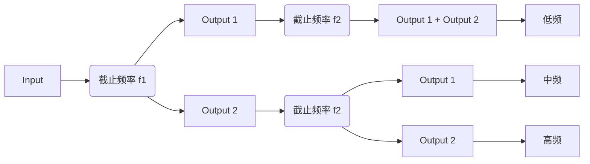

___

## 简介视频



## 关于

ZL Splitter 是一款多功能音频分离插件，可以将输入信号分离为：

- 左/右声道信号
- 中/侧声道信号
- 低频/高频信号
- 瞬态/稳态信号

路由可以按照下图设置：

## 安装

前往[此链接](https://github.com/ZL-Audio/ZLSplitter/releases/latest)下载对应您操作系统的安装器：
- 后缀名为`.dmg`：macOS 系统安装器（包含 `VST3` 和 `AU`）。
- 后缀名为`.exe`：Windows 系统安装器（包含 `VST3` 和 `LV2`）。
- 后缀名为`.zip`：Linux 系统安装器（包含 `VST3` 和 `LV2`）。

更多信息请阅读帮助中的[插件安装](../help/plugin_installation)页面。

ZL Splitter 按照 [GPLv3](https://www.gnu.org/licenses/gpl-3.0.en.html) 进行许可。

以下提醒来自 [由 源译识 翻译的 GPLv3](https://atomgit.com/translation/Contransus) 第九项条款。

**您无需为了接收或运行本程序副本而接受本许可证。仅是因为使用点对点传输接收副本而发生的被覆盖作品的辅助传播，您也无需接受本许可证。然而，除了本许可证以外，没有任何其他文件授权您传播或修改任何被覆盖作品。如果您不接受本许可证，这些行为（传播和修改）即构成版权侵权。因此，如果您修改或传播被覆盖作品，就表示您接受了本许可证。**

VST® is a trademark of Steinberg Media Technologies GmbH, registered in Europe and other countries.

## 用户界面

用户界面由上方面板、左侧面板和右侧面板构成。

### 通用操作

#### 按钮

单击即可切换按钮的「按下」「弹起」状态。

#### 旋钮/横向滑块

可以通过鼠标拖拽/单击、滑动鼠标滚轮调整数值。可以通过 Ctrl/Command + 鼠标滚轮精细调整数值。

### 上方面板

___

  
  

双击该图标可以打开[外观设置面板](#外观设置面板)。

___

  

- 按下：`Output 1` 输出 右声道/侧声道/高频/稳态 信号，`Output 2` 输出 左声道/中声道/低频/瞬态 信号。
- 弹起：`Output 1` 输出 左声道/中声道/低频/瞬态 信号，`Output 2` 输出 右声道/侧声道/高频/稳态 信号。

___

**分离模式**

  

左/右声道分离

  

中/侧声道分离

  

低频/高频分离

  

瞬态/稳态分离

___

### 左侧面板

左侧面板用于调整当前分离模式的参数，会随着分离模式的调整而变化。

#### 左/右声道分离

___

**混合（Mix）**

控制左/右声道的混合比例

___

#### 中/侧声道分离

___

**混合（Mix）**

控制中/侧声道的混合比例

___

#### 低频/高频分离

___

**混合（Mix）**

控制低频/高频的混合比例

___

**滤波器结构**

- SVF：状态变量结构
- FIR：截断反转结构

> 当滤波器为 SVF 结构，该滤波器会产生显著的相位改变。在这种情况下，不应当将输出与原始信号直接混合 或者 级联多个 低频/高频 分离器。如果确实需要级联，可以参照[级联 SVF 滤波器](#级联-svf-滤波器)进行设置。

> 当滤波器为 FIR 结构，该滤波器的不会产生相位改变，但会产生延时。延时的具体大小取决于采样率和滤波器斜率。

___

**滤波器斜率**

共有三种滤波器斜率可供选择：12 dB/oct、24 dB/oct、48 dB/oct。

___

**截止频率（Freq）**

___

#### 瞬态/稳态分离

___

**强度（Strength）**

强度为 0 时不进行分离。

___

**平衡（Balance）**

平衡越小，瞬态信号越少，稳态信号越多，反之亦然。

___

**保持（Hold）**

保持越大，瞬态衰减速度越慢。

___

**频谱平滑（Smooth）**

- 频谱平滑为 0 时，信号的不同频率部分相对独立地进行瞬态/稳态分离
- 频谱平滑为 100 时，信号整体地进行瞬态/稳态分离

___

### 外观设置面板

外观设置面板控制颜色、滑块操作等设置。下面将按照从上至下的顺序介绍。

___

您可以通过单击左侧色块来调整颜色。

**文字颜色（Text Colour）**

**背景颜色（Background Colour）**

为了良好的显示效果，请将文字/背景设置为对比度高的颜色。

**阴影颜色（Shadow Colour）**

**发光颜色（Glow Colour）**

**鼠标滚轮敏感度（Mouse-Wheel Sensitivity）**

- Rough：未按下 Ctrl/Command 时鼠标滚轮的敏感度
- Fine：按下 Ctrl/Command 时鼠标滚轮的敏感度

**旋钮操作方式（Rotary Slider Style）**

- Circular：鼠标旋转控制旋钮
- Horizontal：鼠标水平滑动控制旋钮
- Vertical：鼠标竖直滑动控制旋钮
- Horiz + Vert：鼠标水平/竖直滑动控制旋钮
- Distance：将旋钮从最小值拖动至最大值鼠标需要移动的相对距离。不对 Circular 方式生效。

___

  

保存当前外观设置。

___

  

舍弃所有未保存设置并载入上一次保存的设置。

___

  

舍弃所有未保存设置并关闭外观设置面板。

___

## 附录

### 自动化

您可以启用所有参数的自动化。在自动化时，混合（Mix）和 SVF 滤波器的截止频率会每个样本改变一次，其他参数均每个缓冲区改变一次。

### 级联 SVF 滤波器

## 致谢

感谢 [JUCE](https://github.com/juce-framework/JUCE) 框架以及 [JUCE 论坛](https://forum.juce.com/)。

感谢所有软件使用者以及提供的意见和建议。

## 反馈

如果您有一般性的建议或疑问，可以在[讨论区](https://github.com/ZL-Audio/ZLSplitter/discussions)提出。

如果您有针对性的错误报告或功能要求，可以在[问题区](https://github.com/ZL-Audio/ZLSplitter/issues)提出。

## 免责声明

该免责声明来自 [由 源译识 翻译的 GPLv3 协议](https://atomgit.com/translation/Contransus) 第十五、十六项条款。

**在适用法律允许的范围内，本程序没有任何保证。除非另有书面说明，否则版权持有人和/或其他各方按“原样”提供本程序，而不提供任何明示担保或默示保证，包括但不限于对适销性和特定用途适用性的默示保证。关于本程序的质量和性能的全部风险皆由您承担。如果本程序确有缺陷，您将承担所有必要的服务、维修或修正的费用。**

**在任何情况下，除非适用法律要求或经书面同意，否则任何版权持有人或任何其他按照上述许可修改和/或传输本程序的一方皆不对您的损失负责，包括因不再使用或无法使用本程序而引起的任何一般的、特殊的、偶然的或继发性的损失（包括但不限于数据丢失或数据偏差造成的损失、或本程序无法与任何其他程序一起运行使您或第三方遭受的损失），即便该持有人或其他人已被告知此种损失的可能性。**