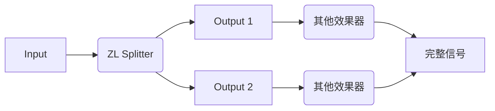
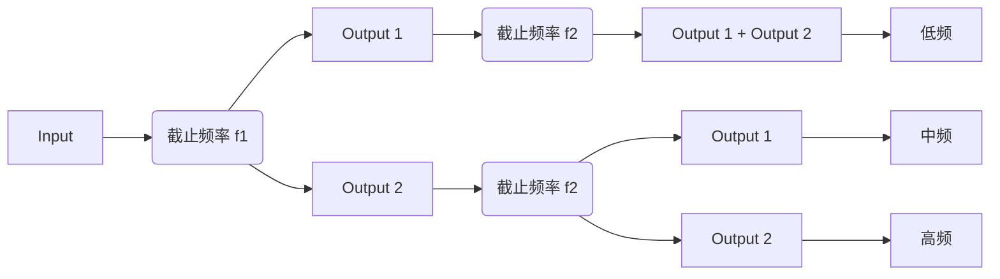

-----

## 关于

ZL Splitter 是一款多功能音频分离插件，可以将输入信号分离为：

- 左/右声道信号
- 中/侧声道信号
- 低频/高频信号
- 瞬态/稳态信号
- 峰值/稳态信号

路由可以按照下图设置：

## 顶部面板

-----

双击该标志将打开[外观设置面板](#外观设置面板)。

-----

**分析器图例**

___

**FFT**

- 按下：打开 FFT 分析器

___

**MAG**

- 按下：打开 幅值分析器

___

  

- 按下：交换 Output 1 和 Output 2

___

  

- 释放：旁通插件

___

## 左侧面板

当鼠标移至插件窗口左侧，左侧面板会打开。您可以通过其选择并调整分离模式。您可以通过单击[分析器面板](#分析器面板)来关闭左侧面板。
___

  

- 按下：输入 -> Output 1，静音 -> Output 2

  

- 按下：左声道 -> Output 1，右声道 -> Output 2

  

- 按下：中声道 -> Output 1，侧声道 -> Output 2

  

- 按下：低频 -> Output 1，高频 -> Output 2

  

- 按下：瞬态 -> Output 1，稳态 -> Output 2

  

- 按下：峰值-> Output 1，稳态 -> Output 2

___

### 左/右声道分离

___

**混合（Mix）**

控制左/右声道的混合比例

___

### 中/侧声道分离

___

**混合（Mix）**

控制中/侧声道的混合比例

___

### 低频/高频分离

___

**混合（Mix）**

控制低频/高频的混合比例

___

**滤波器结构**

- SVF：状态变量结构
- FIR：截断反转结构

> 当滤波器为 SVF 结构，该滤波器会产生显著的相位改变。在这种情况下，不应当将输出与原始信号直接混合 或者 级联多个 低频/高频 分离器。如果确实需要级联，可以参照[级联 SVF 滤波器](#级联-svf-滤波器)进行设置。

> 当滤波器为 FIR 结构，该滤波器的不会产生相位改变，但会产生延时。延时的具体大小取决于采样率和滤波器斜率。

___

**滤波器斜率**

共有三种滤波器斜率可供选择：12 dB/oct、24 dB/oct、48 dB/oct。

___

**截止频率（Freq）**

___

### 瞬态/稳态分离

与 峰值/稳态分离 不同，瞬态/稳态分离 使用一个基于傅立叶变换的模型分离瞬态/稳态信号。它们不共享参数。

___

**强度（Strength）**

强度为 0 时不进行分离。

___

**平衡（Balance）**

平衡越小，瞬态信号越少，稳态信号越多，反之亦然。

___

**保持（Hold）**

保持越大，瞬态衰减速度越慢。

___

**频谱平滑（Smooth）**

- 频谱平滑为 0 时，信号的不同频率部分相对独立地进行瞬态/稳态分离
- 频谱平滑为 100 时，信号整体地进行瞬态/稳态分离

___

### 峰值/稳态分离

与 瞬态/稳态分离 不同，峰值/稳态分离 使用一个类似压缩器的模型分离峰值/稳态信号。它们不共享参数。

___

**触发（Attack）**

触发越大，峰值启动速度越慢。

___

**平衡（Balance）**

平衡越小，峰值信号越少，稳态信号越多，反之亦然。

___

**保持（Hold）**

保持越大，峰值衰减速度越慢。

___

**平滑（Smooth）**

平滑越大，峰值/稳态变换的频率越低。

___

## 分析器面板

### FFT 分析器

- 您可以在左下角选择最低频率
- 您可以在右下角选择最高频率
- 您可以在右下角选择最低 dB 刻度
- 您可以将鼠标悬停在分析仪上 2 秒钟来冻结 FFT 分析仪，移动鼠标即可恢复

### 幅值分析器

- 您可以在左下角选择时间长度
- 您可以在右下角选择幅度类型
- 您可以在右下角选择最低 dB 刻度

___

## 外观设置面板

外观设置面板控制频谱图颜色、滑块操作等设置。下面将按照从上至下的顺序介绍。

#### 颜色（Colour）

您可以通过单击左侧色块来调整颜色，通过拖动右侧滑块来改变透明度。

**文字颜色（Text Colour）**

**背景颜色（Background Colour）**

为了良好的显示效果，请将文字/背景设置为对比度高的颜色。

**阴影颜色（Shadow Colour）**

**发光颜色（Glow Colour）**

**网格线颜色（Grid Colour）**

**输出 1 颜色（Output1 Colour）**

**输出 2 颜色（Output2 Colour）**

**Colour Map 1**

**Colour Map 2**

**导入（Import Colours）**

- 导入颜色设置（`.xml` 文件）

**导出（Export Colours）**

- 导出颜色设置（`.xml` 文件）

#### 控制（Control）

**鼠标滚轮敏感度（Wheel Sensitivity）**

- Rough：未按下 Shift 时鼠标滚轮的敏感度
- Fine：按下 Shift 时鼠标滚轮的敏感度
- 反转：按下 Shift 时是否反转鼠标滚轮方向

**鼠标拖拽敏感度（Drag Sensitivity）**

- Rough：未按下 Shift 时鼠标拖拽的敏感度
- Fine：按下 Shift 时鼠标拖拽的敏感度

**旋钮操作方式（Rotary Slider Style）**

- `Circular`：鼠标旋转控制旋钮
- `Horizontal`：鼠标水平滑动控制旋钮
- `Vertical`：鼠标竖直滑动控制旋钮
- `Horiz + Vert`：鼠标水平/竖直滑动控制旋钮
- Distance：将旋钮从最小值拖动至最大值鼠标需要移动的相对距离。不对 Circular 方式生效。

**旋钮/滑块双击（Slider Double Click）**

- 返回默认值（`Return Default`）: 双击返回默认值; Ctrl/Command + 双击打开数值编辑器。
- 打开数值编辑器（`Open Editor`）: 双击打开数值编辑器; Ctrl/Command + 双击返回默认值。

**导入（Import Controls）**

- 导入控制设置（`.xml` 文件）

**导出（Export Controls）**

- 导出控制设置（`.xml` 文件）

#### 其他（Other）

**刷新率（Refresh Rate）**

为了更好的分析器显示，请将该值设置为您显示器刷新率的几分之一。例如：

- 如果您显示器刷新率为 120 Hz，您可以设置为 120 Hz、60 Hz 或 30 Hz。不要设置为 90 Hz。
- 如果您显示器刷新率为 90 Hz，您可以设置为 90 Hz 或 30 Hz。不要设置为 60 Hz。

**频谱图设置**

- Tilt：控制（额外的）频谱图倾斜斜率
- Speed：控制（额外的）频谱图衰减速度

**曲线粗细度**

控制幅值分析器和 FFT 分析器曲线粗细度

**提示（Tooltip）**

选择提示语言。会在插件窗口重新打开后生效。
#### 底部按钮

___

  

- 保存当前外观设置。

___

  

- 载入部分默认设置。

___

  

- 舍弃所有未保存设置并关闭外观设置面板。

___

## 快捷键

一般来说，按下 Shift 可以进行精细调整，按下 Ctrl/Command 可以进行特殊调整。如果按下 Shift 后鼠标滚轮的方向发生反转，可以再次设置反转以进行纠正。

- 当用 鼠标拖拽/鼠标滚轮调整 旋钮/滑块，按下 Shift 可以进行精细调整

## 附录

### 自动化

您可以启用所有参数的自动化。在自动化时，混合（Mix）和 SVF 滤波器的截止频率会每个样本改变一次，其他参数均每个缓冲区改变一次。

### 级联 SVF 滤波器

